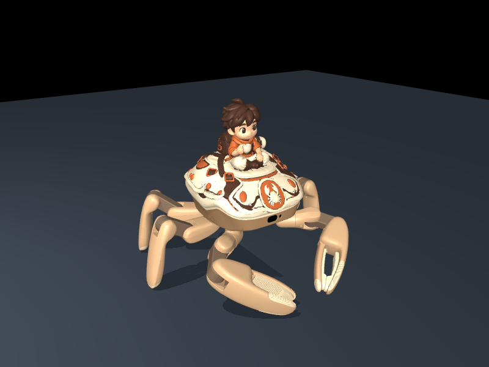
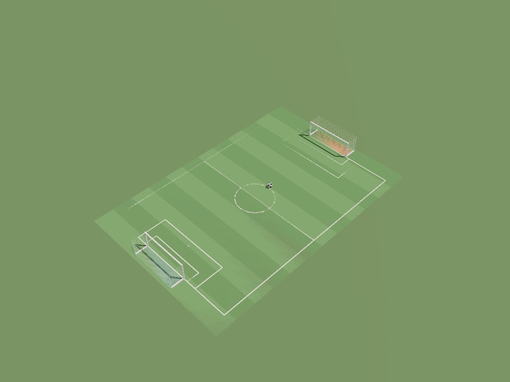

# Design Workflow

**English** | [简体中文](README.zh-CN.md)

Design appearances and create worlds for **Jumper**, a 22-DoF hexapod.

Open this repository in an AI coding assistant and describe what you want in one sentence. The linked guides below give your assistant the workflows to follow.

## One sentence to design an appearance

> Design a warm sand ranger appearance for Jumper with coordinated body and limb colors, then export a `.skin`.

| | | |
|:-:|:-:|:-:|
|  |  |  |
| [**Warm sand ranger**](library/skins/warm-sand-ranger-integrated-v2.skin) | [**Silver armor**](library/skins/mecha-tripo-v3.skin) | [**Raphael Turtle**](library/skins/raphael-turtle-v1.skin) |

[Browse all skins](library/skins/README.md)

## One sentence to create a scene

> Create a park pump-track scene for Jumper with rolling terrain, trees and benches, then export a `.map`.

| | | |
|:-:|:-:|:-:|
|  |  |  |
| [**Park pump track**](library/maps/park-pump-track.map) | [**Bedroom**](library/maps/bedroom.map) | [**Soccer**](library/maps/soccer.map) |

[Browse all maps](library/maps/README.md)

The examples are existing appearance and scene packages. Your assistant asks you to choose a design when needed, validates package structure and compatibility, and may need an external modeling tool or supplied model for new geometry; arbitrary designs are not guaranteed to finish automatically in one step, and automated checks do not replace visual review, controller evaluation, or physical fitting.

## Where to find things

| | |
|---|---|
| [Jumper](https://github.com/KingKongRobotics/jumper) | Shared entry point for appearance design, motion training, and scene creation. |
| [Quick start](docs/quickstart.md) | Install the tools, verify an example, and export a map. |
| [Workflow](docs/workflow.md) | Appearance, environment, and physical-shell workflows. |
| [Content package protocol](docs/content-packages.md) | `.skin` and `.map` formats, manifests, and validation. |
| [Engineering and acceptance](docs/engineering-and-acceptance.md) | Digital evidence, visual review, printing, and physical-fit boundaries. |

Training and controller work are separate from this repository. Third-party components and imported scene code retain their respective notices and license terms; see [NOTICE](NOTICE) and [licensing details](docs/licensing.md).

## License

Copyright 2026 KingKong Robotics.

Maintainer-owned project materials are licensed under Apache-2.0. See [LICENSE](LICENSE),
[NOTICE](NOTICE), and [licensing details](docs/licensing.md).
Third-party materials remain under their respective terms, and generated outputs do not
automatically inherit this repository's license.
