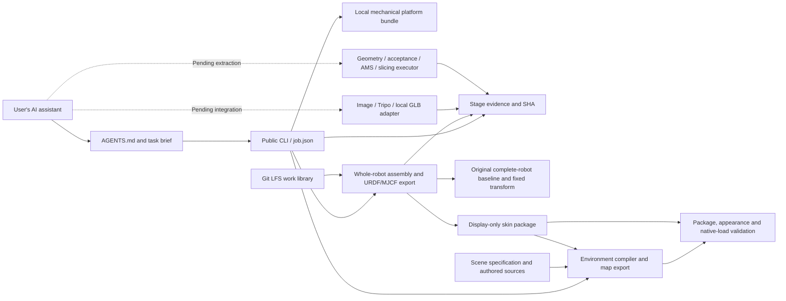

# Architecture and use with any AI assistant

An AI assistant orchestrates the workflow through files and commands. Shared rules and calculations must not be hidden in one provider's chat history, browser login, or proprietary tool name.

Solid edges are available; dashed executors have not yet been migrated to a public implementation. Since v0.2, an actual print shell can be mounted on a real whole-robot model and simulation files exported. Cloning the repository alone cannot automatically engineer every arbitrary new shape.

## Keep data separate

| Data | Location | Version and responsibility |
|---|---|---|
| Workflow code and rules | `src/`, `scripts/`, `AGENTS.md`, `docs/` | Shared Git version |
| Configuration contract | `config/`, `schemas/` | Examples and schemas only, no account state |
| Mechanical platform | Description in `platforms/catalog/`, installation in `.local/platforms/` | Platform ID, original STEP SHA, manifest SHA; versioned separately from code |
| Complete-robot simulation baseline | Current `robots/jumper/`; retained `robots/jumper-v1-6/` and `robots/hexa-v1/` | Each profile binds source revision, MJCF/mesh SHAs, whole motion tree, inertia, and its own CAD→parent/base registration |
| Finished works and simulation packages | `library/` | Selected finals, JSON indexes/summaries; STL/AMS/meshes in LFS |
| User environment | `.local/runtime.json`, service's own identity store | Per-user, outside Git |
| One project | `workspaces/<name>/` | Relative paths, input copies, parameters, reports, delivery SHAs; local by default |

The public catalog describes versions. The installer checks internal package integrity; the CLI also checks the catalog-fixed manifest SHA for known installed platforms. An unknown platform gets only local package-internal validation, clearly reported. **A SHA is not a publisher signature**; obtain repository and bundle from a trusted source.

## AI entry points

`AGENTS.md` is the shared rulebook. `CLAUDE.md` and `skills/robot-shell-workflow/SKILL.md` point to it and do not maintain separate algorithms. Any assistant able to read local files and execute Python can use the same commands. Image, browser, and model-service support depend on its actual tools.

“One request” means the user need not manually chain dozens of scripts. It does not waive initial installation, design selection, the user's service login, or genuinely missing information. The first scope stays on the same robot rather than pretending any STEP file is an accepted platform.

## Direction for stage executor interfaces

Future executors read `job.json`, platform manifest, and registered artifacts, then write new project-local files and machine-readable reports. At minimum the public interface needs input SHAs, parameters, code/dependency versions, units/coordinates, output SHAs, actual check methods/values/thresholds, and limitations. Only acceptance modules can issue scoped validation conclusions; a task ledger cannot infer them.

Separate geometry work into appearance import, positioning, constrained deformation, cavity and roots, protected interface assembly, and frozen export. AMS and slicing use that same frozen mesh. Model providers supply appearance only; they cannot modify or decide the mechanical interface.

This is a migration direction. There is no automatic plugin loader or whole-flow `run` / `resume` command yet. Current `next` gives action guidance; `checkpoint` registers evidence.

## Implemented whole-robot exporter

`src/shellflow/simulation.py` runs through `scripts/export_simulation.py` or public CLI `assemble`. Inputs are original-CAD millimeter STL, optional matching AMS, and the task-selected robot profile. The current new-task default is `robots/jumper/profile.json`. Output must include complete `robot.urdf`, native-setting-preserving `robot.xml`, preview `scene.xml`, relative meshes, and `simulation-report.json`.

The current `jumper` baseline derives from `jumper/urdf/jumper.urdf` with 41 source links and 22 indexed movable joints. The importer adds virtual `floating_base`; source has no active sensor, camera, or actuator elements. It replaces only the `upper_shell_link` visual, retaining all other links, joints, and base. The earlier `jumper-v1-6` baseline came from `kk-rl-mjlab` commit `5dca5e53ab99c02a9d0cf4d80b010777f53d35bb` under `assets/jumper/`. It is MJCF, despite `model="V1.urdf"`, without a separate original URDF. It has 37 robot links plus world, 22 movable joints, 14 fixed connections, and a free root. Its `shangke_link` visual alone was replaced. Each historical package remains bound to that profile.

For historical `jumper-v1-6`, independent CAD→parent/base registration differed from `hexa-v1`: seam P95 about 0.07293 mm and sampled six-hole P95 below 0.053 mm. Those were display-coordinate registration results, not real print tolerance proof. Old `hexa-v1` packages remain in `library/simulations/<id>/`; historical `jumper-v1-6` packages are in `library/simulations/jumper-v1-6/<id>/` and do not inherit old pass status. Current `jumper` registration checks the seam only; do not carry historical six-hole evidence forward.

Simulation appearance targets about 100,000 faces, separately from unchanged print STL. When AMS geometry matches, `paint_color` / `filament_colour` assign approximate colors on the simplified mesh; unsupported encoding or mismatch explicitly falls back to monochrome. 3MF bed transform never enters assembly. Reports retain source SHAs, simplification error, color route, and dependency versions.

URDF expresses the motion tree and inertia tensors but cannot fully carry native MJCF actuators, sensors, cameras, and solver settings, so both formats ship. Historical `jumper-v1-6` has five sensors, one camera, and zero source actuators, with actuators injected by the kk task runtime. Do not fabricate control configuration from movable-joint count. Current collision and inertia use `baseline_preserved`; the new shell has no rederived physical mass or collider, so `physical_dynamics_validated=false`.

Producer `whole_robot` checks the full source link set and joint tree. An independent URDF verifier checks motion/inertia data and ten poses. The CLI also rejects non-whole-robot results and compares report-bound shell/profile SHAs; its count floor catches shell-only results but cannot replace full-tree validation.

Optional `.[sim]` includes NumPy, SciPy, Trimesh, MuJoCo, fast-simplification, and rtree. On Windows an in-memory VFS resolves assets under paths containing Chinese characters, reducing MuJoCo path issues; that does not certify every external URDF consumer. See [whole-robot simulation](simulation.md) for actual loading and limited numerical checks.

## Reproducibility and invalidation

The CLI fingerprints project inputs/configuration, platform manifest, core Python source, and predecessor evidence; on readback it checks file SHA and size. Changed files, parameters, platforms, or core code make registered evidence stale.

Project creation binds a valid platform manifest SHA. A task created before platform installation binds a version explicitly when first registering preparatory evidence. Read-only `status/next` do not mutate the task. Engineering and later evidence cannot register on an unbound or invalid platform. Restore a damaged/replaced bound baseline first.

Schema 2 adds mandatory `simulation` and dual-delivery configuration. New tasks default to `jumper`; existing schema 2 retains its selection, and missing schema 1 values conservatively map to `hexa-v1`. Queries adapt in memory without rewriting or upgrading. `start --robot-platform` selects a new task's baseline; `assemble --robot-platform` can explicitly switch an old task. A single atomic write binds the new selection and evidence only after exporter, whole-robot and URDF verification, output SHA readback, and unchanged shell/profile inputs.

`index_simulations.py` binds existing selected-platform packages into work metadata; `--robot-platform hexa-v1` selects legacy packages. It checks profile, print provenance, and output SHAs, without generating missing packages. Registration and indexing do not certify manufacturing as a whole. If print or simulation delivery is missing, a new upper-shell task is incomplete.

External generation is stochastic; a successful model request may not reproduce the same appearance. Retain actual input images, downloaded model, and SHAs. Future geometry executors must record their own code/dependency environments beyond control-layer fingerprints. Machine paths are addressing configuration rather than shared algorithm parameters; path conversion cannot change original asset bytes.
