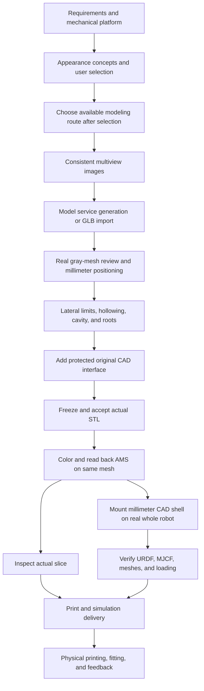

# Design Workflow: appearances and environments

Choose a route before preparing tools or creating a task:

- **Appearance:** create or reuse a complete-robot visual assembly, then export and validate a display-only `.skin`. Printing is separate.
- **Environment:** follow [scene and map production](#scene-and-map-production) to author terrain, props and challenges, include the default robot and spawn, and validate a `.map`. No print-shell task or slicing is required.
- **Physical shell:** when requested, follow the engineering, printing and assembly stages below.

## Appearance selection gate

This applies to display-only appearances as well as physical shells:

1. Interpret the brief and show distinct candidates with their silhouette, proportions and palette. Use concept images when the assistant has an authorized image tool; otherwise clearly label design sketches or descriptions and state that no model exists yet.
2. Wait for an explicit user choice. A user-specified existing design/model counts as that choice; do not ask again. Never fabricate confirmation from silence or an assistant-selected default.
3. Save the selected references and the user's actual confirmation. Choose the modeling route only afterward, following [provider and local modeling rules](providers.md). Before consuming any service credits, complete the [mandatory service preflight](providers.md#mandatory-service-preflight-before-spending-credits): check the current account tier, credits/export allowance, selected model and target-format export eligibility, total cost and existing authorization. Record the evidence locally. Unknown download eligibility blocks generation; a failed export does not authorize an extra generation attempt. Tool discovery is not authorization to spend credits.
4. Generate the selected design and compare actual front, side, back and whole-robot color renders with the references. Check gray geometry, silhouette, proportions, characteristic details, palette and activity clearances. Revise mismatches before exporting. Material changes to the design require a new user selection.

For a physical-shell ledger, create `evidence/selection.json` using this structure:

```json
{
  "schema": "design-selection/1",
  "selected_design": "candidate-a",
  "user_confirmation": "Replace with the actual user statement selecting this design",
  "references": [
    {
      "role": "selected_design",
      "path": "evidence/candidate-a.png",
      "sha256": "REPLACE_WITH_ACTUAL_FILE_SHA256",
      "bytes": 12345
    }
  ]
}
```

Paths are relative to the task directory. Use actual SHA256 and byte counts; references can be images, a supplied model or a selected written specification. Do not copy the placeholder as confirmation. Keep `selection.json` inside the task and register it:

```sh
python scripts/shellflow.py checkpoint bee-demo --stage concept --artifact evidence/selection.json
```

The concept checkpoint rejects missing/malformed selection evidence. `status`/`next` mark changed references stale, and multiview, appearance and engineering checkpoints require a current selection. The ledger checks records and hashes, not whether a human really spoke: the assistant must preserve truthful user evidence. It cannot prevent an external tool from being run outside the workflow.

Display-only work keeps the same selection record in its working directory without creating a print job. Low-level package export, validation and unchanged-asset repackaging remain usable independently and do not enforce creative approval. Existing ledgers lacking selection evidence must recover a real prior choice or obtain one before new modeling; do not fabricate migration evidence.

## Physical-shell production

The initial scope is **changing appearance on the same crab robot**. The mechanical print platform is the user-installed and checked `original-robot-v1`; do not guess its mounting interface anew. New tasks now default to the `jumper` whole-robot simulation baseline, while existing tasks keep their selection. Mechanical platform and complete-robot model are versioned separately. Historical v0.2 tasks used `jumper-v1-6`; the commands below describe the current default.

## One-time setup and each creation

Once: obtain the repository and Git LFS assets, install a platform bundle you have rights to use, prepare Python and local modeling/slicing tools, and use your own AI/model-service accounts. Whole-robot export also requires optional `.[sim]` dependencies. Verify separately whether each tool runs and supports the current system; the control layer does not install CAD dependencies.

For each creation, the AI interprets the request, organizes requirements, reads project status, and runs only affected stages. For every new appearance, stop at concept selection and wait for the user before choosing a modeling tool or creating geometry. Reuse an explicit existing user selection; routine implementation decisions must preserve that design. Login verification, missing inputs, or real-printer details may still need user participation.



## Stage inputs, artifacts, and gates

This is the production specification. **The `assemble` command has actually exported whole-robot simulation files since v0.2; image generation, generic geometry fitting, print acceptance, and slicing still require their corresponding external tools.** An artifact must actually exist before it can be registered as stage evidence.

| CLI stage | Work and input | Evidence | Gate before next stage |
|---|---|---|---|
| `requirements` | User brief, platform bundle, equipment, assembly needs | Structured constraints, platform SHA, unknowns | Distinguish front closure from underside mounting opening; record left/right envelope and front/back allowance separately. |
| `concept` | Platform outline, aesthetic direction, color | Concept images, selected version and reason | Shape grows from the shell and agrees with user selection. |
| `multiview` | One selected design | Actual front/side/back inputs and view list | Features, decoration, color, and proportions agree across views; explain routes that need no multiview. |
| `appearance` | Authorized model service or local GLB | Original model, gray-mesh views, millimeter transform | Actual nose/eyes/back match intent; no fabricated generation record. |
| `engineering` | Appearance copy, platform interface, internal-space basis | Engineered model, cavity/transitions/roots, deformation parameters | No intrusion into leg space laterally; no unintended front/back compression; interface and channels protected. |
| `validation` | Frozen mesh, actual STL, independent mechanical reference | Geometry, wall, interface, channel, envelope report and actual multiview mesh | Every criterion has a source, measured value, and scope; recheck after mesh changes. |
| `ams` | Same frozen mesh and color assignments | Colored 3MF, readback comparison, actual preview | Scale, geometry, colors, and material slots correspond; no silent mesh rebuild. |
| `slicing` | 3MF and confirmed printer or labeled reference preset | Slice report, path/layer inspection, configuration | Full slicing succeeds; bed/support/tower conflicts and unverified items are resolved or stated. |
| `simulation` | Frozen millimeter STL, matched AMS, selected robot profile and assembly transform | Complete robot URDF/MJCF/scene, relative meshes, `whole_robot`, URDF pose verification, input/output SHAs | Retain every body/link/joint and base; match colors or report fallback; state collision/inertia policy and limits. |
| `delivery` | Checked final print and simulation files | STL, AMS 3MF, complete-robot URDF/MJCF, meshes, editable source, instructions, reports, SHA inventory | Both deliveries actually complete and trace to the same new shell; digital and physical status separate. |

Existing models can be imported locally without regeneration. A selected concept need not be recreated. If a stage is inapplicable, record why; do not invent a generation result.

## Commands and evidence meaning

Run from the repository root, replacing `bee-demo` with your task name:

```sh
python scripts/shellflow.py start --name bee-demo --platform original-robot-v1 --brief "Bee upper shell, closed front" --front-opening close
python scripts/shellflow.py next bee-demo
python scripts/shellflow.py status bee-demo
```

`--platform` selects the mechanical platform. `start --robot-platform` explicitly selects the whole-robot baseline; new tasks default to `jumper`.

After writing real requirements to project file `evidence/requirements.md`, register them:

```sh
python scripts/shellflow.py checkpoint bee-demo --stage requirements --artifact evidence/requirements.md
```

`--artifact` is repeatable. Relative paths are rooted at the project directory; an external absolute-path file is copied into project evidence. `PROJECT` can be a task name or a directory containing `job.json`. Put `--root` before the subcommand when setting repository root.

After print engineering creates `delivery/print/shell.stl` and matching `ams.3mf`:

```sh
python -m pip install -e ".[sim]"
python scripts/shellflow.py assemble bee-demo --shell delivery/print/shell.stl
```

`assemble` requires a bound, valid platform and unchanged source input. It runs the real whole-robot exporter, checks `whole_robot`, URDF verification, required files, every declared output SHA, source-shell SHA, and selected profile SHA, then registers `simulation`. Default output is project `delivery/simulation/`; existing output is not overwritten. Use `--output` for another attempt.

For an old task to switch explicitly to the current robot:

```sh
python scripts/shellflow.py assemble bee-demo --shell delivery/print/shell.stl --robot-platform jumper --output delivery/simulation-jumper
```

The new selection is saved only after export and all checks succeed. Failure does not write a new binding. A successful switch still makes affected historical evidence stale by task fingerprint, without rewriting its acceptance conclusion.

If same-directory `ams.3mf` matches STL geometry exactly, the exporter extracts its palette and transfers colors to simplified simulation appearance. Only the simulation copy changes; print files remain untouched. Unsupported painting produces an explicit monochrome fallback. The shell's original coordinates use the current profile's CAD→parent/base transform, never an old platform translation or 3MF bed-placement transform. On current `jumper`, only the `upper_shell_link` visual is replaced; all other bodies, links, joints, and the base remain. Historical `jumper-v1-6` used `shangke_link` instead.

Output is JSON. Exit code `0` means command completion, `1` means a status check found an integrity/platform obstacle, and `2` means parameter or operational error. `start` can create a preparatory task without an installed platform; this does not mean engineering prerequisites are satisfied. `doctor` discovers tools, not certifies the complete environment.

For a task created before platform installation, register a preparation-stage artifact after installation to bind the platform version. `status/next` are read-only. Engineering and later stages refuse evidence registration without a bound valid reference. A known platform is checked against the catalog manifest SHA.

`pending` means no evidence, `recorded` means file and fingerprint registered, and `stale` means a past registration expired. None are geometry acceptance outcomes. Even when every stage has a file, the CLI reports `digital_acceptance=not_certified_by_shellflow` and validation remains `pending`.

New tasks use schema 2 and require print plus simulation. Existing schema 2 keeps its robot selection. Legacy schema 1 is readable, gains a missing simulation stage, and conservatively defaults to `hexa-v1`; read-only queries do not rewrite old files, while later task writes save the new structure. Compatibility loading never silently upgrades the robot or awards simulation completion.

Complete-robot URDF retains the motion tree and inertia tensors. Native MJCF `robot.xml` retains source sensors, cameras, and solver configuration. Current `jumper` source has 22 movable joints and no active sensor, camera, or actuator elements; historical `jumper-v1-6` had five sensors, one camera, and zero source actuators supplied by the task runtime. The new shell changes visuals only; collision and inertia keep baseline values and `physical_dynamics_validated=false`. Delivering files does not validate new-shell mass, collision, loads, or real motion.

Historical `jumper-v1-6` packages remain in `library/simulations/jumper-v1-6/<id>/`, and `hexa-v1` packages in `library/simulations/<id>/`. `python scripts/index_simulations.py` indexes existing packages for its selected platform; pass `--robot-platform hexa-v1` for old packages. Each work's status comes from actual reports.

## Resume with less context

- Initially read only `AGENTS.md`, platform summary, current `job.json`, and `next`, without scanning every historical case.
- Read stage-specific rules when needed. Keep long logs in project files and return only status, key values, and paths to the AI.
- Input, parameters, platform, control code, or prior evidence changes invalidate relevant records. Current invalidation is conservative; future executors should fingerprint their own code, dependencies, and methods.
- Record design parameters and deformation rules in the project to avoid rederiving them. Reuse only genuinely matching results, never another model's vertex/face IDs.
- Keep every required mechanical and export check. Save repeated context, not acceptance work.

See [engineering and acceptance](engineering-and-acceptance.md) for production checks, [whole-robot simulation](simulation.md) for coordinates and loading limits, and [migration roadmap](migration-roadmap.md) for implementation boundaries.

## Scene and map production

The `.map` route starts from a scene description or an authored/source snapshot, not a print-shell project. Preserve the source and its provenance separately from the generated package. A new `.map/2` carries terrain, props, spawn, and one verified display-only `.skin/3` as its complete default robot; a map is not produced by renaming a scene ZIP or by adding an extension to an upload allowlist. The skin and map may later be composed with another verified skin on the same trusted platform.

For a single scene, prepare an actual scene specification and a reviewed robot-free environment PNG. The formal `--preview` image must be derived from the final environment, with correct color and full framing. Use a trusted profile and a published `.skin/3` for the default robot:

```sh
python scripts/shellflow.py export-map examples/maps/obstacle-course.scene.json --id obstacle-course --title "Obstacle Course" --default-skin library/skins/mecha-tripo-v3.skin --profile robots/jumper/profile.json --preview outputs/reviewed-previews/obstacle-course.png --output outputs/obstacle-course.map
python scripts/shellflow.py verify-package outputs/obstacle-course.map --profile robots/jumper/profile.json --capability rigid --capability jumper --mujoco
```

These are example paths; first create the reviewed PNG and use a fresh output directory. `export-map` compiles the scene and packages a verified default robot; `verify-package --mujoco` checks actual compilation and spawn. This obstacle-course example is for format testing and is excluded from the current formal map library. A new formal map additionally needs the required Web visual declaration, release-rule review, and candidate publication. None of these steps assert printing, a policy rollout, or physical fit.

For the maintained BE-derived collection, use [Web appearance standard](web-appearance-standard.md) and [content release defaults](content-release-rules.md): retain source snapshot, run the real Web construction and visual export, compare source/import views at the same angle, and render robot-free `be-web/1` previews. The standardized batch entry is:

```sh
python scripts/export_map_collection.py --preview-dir outputs/web-appearance-audit/renders --output outputs/reviewed-maps --library outputs/reviewed-library
```

Its `--preview-dir` is required for standardized maps; missing reviewed Web PNGs fail rather than silently using native-rendered thumbnails. It uses authored sources with matching IDs in preference to original BE snapshots, retaining provenance. The command writes packages and publishes them into the candidate library after package checks. Inspect actual embedded thumbnails and robot compositions, verify visual-only additions leave body mass/inertia, joints, collision, and poses unchanged, then switch reviewed candidate packages and indexes to the formal library. The local gallery is generated with `python scripts/content_gallery.py --output outputs/gallery` and should be opened and checked. Website deployment and account synchronization are separate consumer tasks.

## Walkable surfaces and spawn acceptance

Every walkable road, lawn, bridge and ramp needs a collision surface aligned with its visible surface. Decorative geometry with `contype=0` and `conaffinity=0` does not support a robot. Never substitute a lower world plane for an elevated visible road. Do not enable collision on a whole material-merged park mesh: convex-hull collision may bridge gaps or block open routes. Use suitable primitive segments, heightfields or reviewed collision decomposition.

Declare `spawn.position` as the support-floor point, not the robot root position. The bundled robot preview supplies its base offset. Place the spawn on actual stationary support; check local elevation, slope, footprint and clearance. Raising spawn alone does not fix a missing collision surface.

Native default-robot composition checks five downward rays at the spawn center and offsets of 0.05 m. Rays begin 0.25 m above the declared floor. Static scene geometry must have robot-compatible collision masks and a surface within 0.03 m of the declared floor; visible surfaces must agree within 0.03 m. This tolerance is an error rejection bound, not a target modeling accuracy. Failure blocks native composition and map export. The report records this as `spawn_support`, with `dynamic_smoke_tested=false`.

This bounded check does not cover the full robot footprint, routes, geometry above its ray origin, or mesh convex-hull contact approximations. Review all walkable routes and foot placements, including bridge edges and ramp transitions. Before describing a challenge as runnable, perform a short test with the intended robot and controller in the target runtime. Record runtime/controller versions, duration, initial pose, contacts and any loss of support or penetration. A passive unactuated robot falling over is not itself proof of a ground defect. If runtime testing is unavailable, report it as not tested; neither package validation nor the static rays imply walking or Web-import acceptance.
